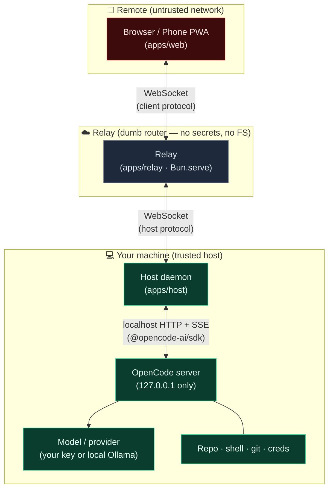
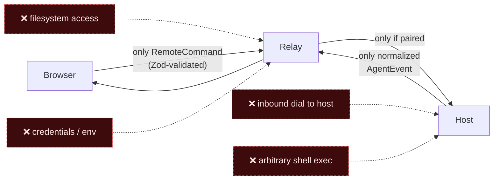
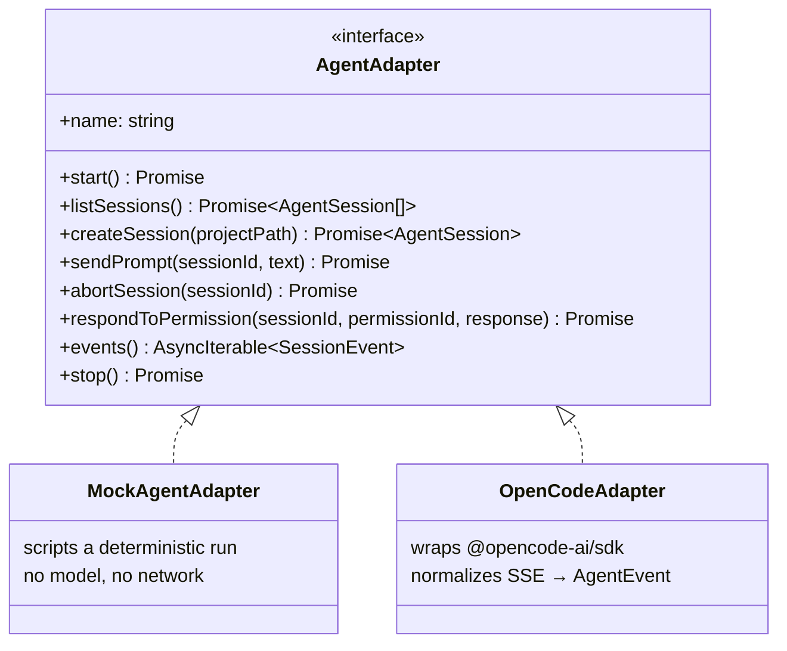
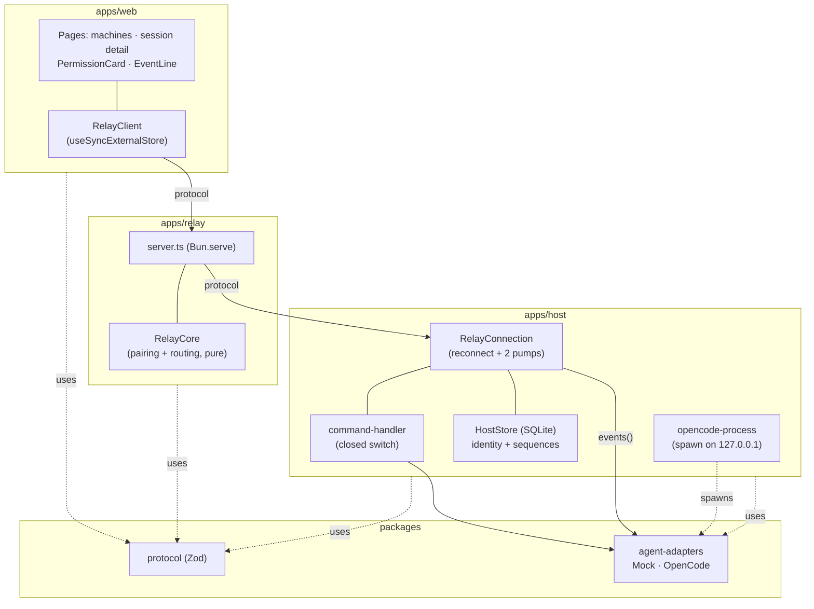
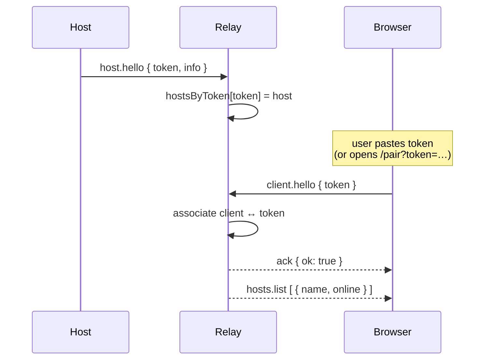
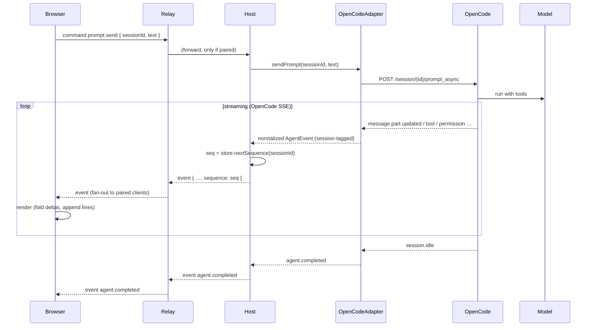
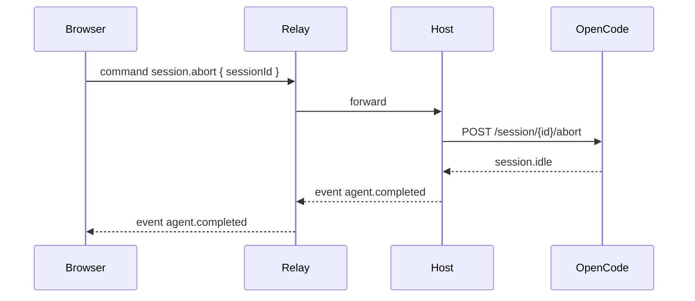
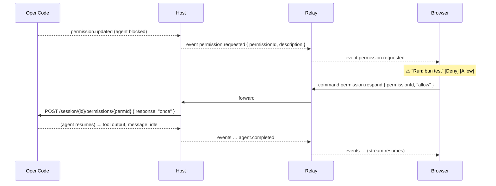
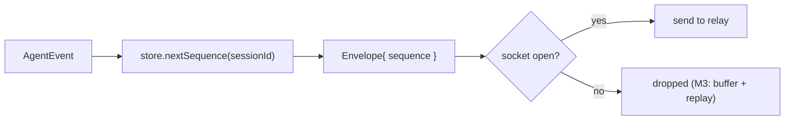

# roamux — Architecture (V0, as-built)

This document explains how roamux is put together **today**: the components,
the trust boundaries, the message protocol, and the data flows for the core
actions (pairing, prompting, streaming events, stopping, and permissions).

> Looking for where the product is headed — multi-host, Ably transport,
> accounts, daemon-owned sessions, multiple agent harnesses? That is the
> **design of record** in [`beta-architecture.md`](beta-architecture.md). This
> file stays the faithful record of the **V0 code that actually runs**.

If you only read one thing, read **§2 Trust boundaries** — the whole design
exists to keep those lines intact.

---

## 1. System overview

roamux is a **remote control plane for local AI coding agents**. Your
machine stays the execution host; a phone or remote browser watches and steers
the local agent through a relay. The agent runtime for V0 is
[OpenCode](https://opencode.ai) — roamux does **not** implement its own agent.



**Direction of trust:** the host is fully trusted (it's your machine), the
browser is untrusted (anyone on any network), and the relay is *semi-trusted* —
it routes bytes but is deliberately given nothing worth stealing.

---

## 2. Trust boundaries (the rules that never bend)

These are enforced in code and asserted in tests. Violating any of them is a
release blocker (see [`CLAUDE.md`](../CLAUDE.md) §3).

1. **OpenCode binds to `127.0.0.1` only.** The host spawns `opencode serve
   --hostname 127.0.0.1`, and an externally supplied `OPENCODE_URL` is rejected
   unless it is localhost.
2. **The host dials out.** The host initiates the WebSocket to the relay; the
   relay can never dial into the host. No local port is exposed publicly.
3. **The relay only routes authenticated pairs.** A host registers a pairing
   token; a client must present the *same* token before anything is routed to or
   from it.
4. **No secrets cross to the relay.** Shell env, credentials, model keys, and
   filesystem contents never leave the host.
5. **No arbitrary remote execution.** Only the explicit `RemoteCommand` variants
   do anything — validated twice (Zod at the relay, a closed `switch` at the
   host). There is no "run this shell string" command by design.



---

## 3. The one abstraction boundary

roamux should eventually drive *any* agent runtime, so exactly one seam is
designed up front and kept pristine:

```
roamux protocol   ⇕   AgentAdapter   ⇕   OpenCode
```

- Everything above the adapter (host, relay, web) speaks only the **normalized
  protocol** — a small vocabulary of commands and events.
- Everything OpenCode-specific lives **only** inside `OpenCodeAdapter`.
  `@opencode-ai/sdk` is imported in that one file and nowhere else.
- Swapping in `OpenHandsAdapter` or `AiderAdapter` later touches nothing else.

> This single V0 seam becomes **three** in Beta (`Transport` ⇔ protocol ⇔
> `HarnessAdapter`, with `HostSessionManager` owning lifecycle). See
> [`beta-architecture.md`](beta-architecture.md) §3.



---

## 4. Components

| Component | Package | Responsibility |
|---|---|---|
| **Web** | `apps/web` | Mobile-first Next.js PWA. One WebSocket to the relay; renders machines, sessions, live event stream, prompt box, Stop, and Allow/Deny cards. |
| **Relay** | `apps/relay` | Stateless-ish `Bun.serve` router. Pure `RelayCore` does pairing + routing; no agent logic, no filesystem. |
| **Host** | `apps/host` | Long-running daemon. Dials the relay (with reconnect), drives an `AgentAdapter`, tags events with per-session sequence numbers, persists identity + sequences in SQLite, manages the OpenCode process. |
| **Protocol** | `packages/protocol` | Versioned `Envelope<T>`, the command/event unions, and Zod schemas validated at every socket boundary. |
| **Adapters** | `packages/agent-adapters` | The `AgentAdapter` interface + `MockAgentAdapter` + `OpenCodeAdapter`. |



---

## 5. The protocol

Every message on every socket is wrapped in an **Envelope** and validated with
Zod on receipt. Nothing raw ever crosses a socket.

```ts
type Envelope<T> = {
  protocolVersion: 1        // bump = explicit breaking change
  messageId: string         // idempotency / tracing
  deviceId: string          // who sent it
  sessionId?: string        // which agent session (for events/commands)
  sequence?: number         // per-session monotonic (resume-ready, M3)
  timestamp: number
  message: T                // the actual command / event / control frame
}
```

There are three **directional** message unions, each its own Zod schema:

- **Client → Relay:** `client.hello` (pair with a token), `command` (a `RemoteCommand`).
- **Host → Relay:** `host.hello` (register token + info), `event`, `sessions.snapshot`, `host.state`.
- **Relay → Client:** `ack`, `hosts.list`, plus the host-originated `event` / `sessions.snapshot` / `host.state` fanned out.

### Commands (the entire remote-control surface)

```ts
type RemoteCommand =
  | { type: "prompt.send";       sessionId; text }
  | { type: "session.abort";     sessionId }
  | { type: "permission.respond"; sessionId; permissionId; response: "allow" | "deny" }
  | { type: "session.create";    projectPath }
  | { type: "sessions.list" }
```

### Events (normalized agent behavior — runtime-agnostic)

```ts
type AgentEvent =
  | { type: "session.started";     sessionId }
  | { type: "assistant.delta";     text }              // streaming token chunk
  | { type: "assistant.message";   text }              // finalized message
  | { type: "tool.started";        tool; input? }
  | { type: "tool.completed";      tool; output? }
  | { type: "terminal.output";     text }
  | { type: "file.changed";        path }
  | { type: "permission.requested"; permissionId; description; tool?; input? }
  | { type: "permission.resolved"; permissionId; response }
  | { type: "agent.waiting" }
  | { type: "agent.completed" }
  | { type: "agent.failed";        error }
```

The web UI only ever renders these — it has no knowledge that OpenCode exists.

---

## 6. Key flows

### 6.1 Pairing

The host prints a one-time token; the browser presents it; the relay binds them.



### 6.2 Prompt → live event stream → completion

The headline path: an instruction from the phone reaches the local model and its
work streams back live.



### 6.3 Stop (remote abort)



### 6.4 Permission (the main product feature)

The agent pauses; the phone decides; the agent resumes.



`allow → "once"` and `deny → "reject"` in OpenCode's vocabulary.

---

## 7. Sequencing & reconnection

- Every event a host forwards carries a **per-session, monotonically increasing
  `sequence`**, allocated atomically in SQLite (`HostStore.nextSequence`).
- The host reconnects to the relay with exponential backoff; the browser client
  does the same to the relay.
- **Today** delivery is *at-most-once*: if the host↔relay link is down when an
  event fires, that event is dropped. Sequence numbers are already recorded, so
  **M3 resume** is a routing change (client sends last-seen `sequence`, host
  replays the gap) — not a protocol change. This is the whole reason sequencing
  exists from day one.



---

## 8. Persistence

The host keeps a tiny SQLite database (`HOST_DB_PATH`, default
`.roamux/host.sqlite`):

- **`identity`** — a stable `deviceId`, the current `pairingToken`, and the
  machine `name`, so a host keeps its identity across restarts.
- **`sequences`** — the last sequence number per session.

Session *content* is intentionally **not** persisted in V0 (session history is an
M3 item). Postgres is deliberately avoided; SQLite keeps the host self-contained.

---

## 9. Technology choices & why

| Area | Choice | Why |
|---|---|---|
| Runtime / PM | **Bun** | Fast, built-in WebSocket server/client, SQLite, and test runner — fewer moving parts. |
| Language | **TypeScript (strict)** | One language across host/relay/web + shared protocol types. |
| Validation | **Zod** | Parse at every trust boundary; schema *is* the source of truth. |
| Web | **Next.js + React + Tailwind** | Mobile-first PWA quickly; `useSyncExternalStore` binds cleanly to a vanilla WS client. |
| Relay transport | **WebSockets** | Bidirectional, ordered, low-latency; ordering matters for event streams. |
| Persistence | **SQLite** | Zero-config, host-local, survives restarts. Postgres deferred. |
| Agent runtime | **OpenCode** | Mature OSS agent with an HTTP + SSE API and a typed SDK — bring-your-own-model. |

Explicitly **not** used in V0: Kubernetes, Kafka, NATS, Temporal, Redis,
microservices, native mobile apps, custom inference, or a custom agent — all
would add weight without earning it at this stage.

---

## 10. Where to look in the code

| To understand… | Read… |
|---|---|
| The wire format | `packages/protocol/src/{envelope,commands,events}.ts` |
| The adapter seam | `packages/agent-adapters/src/types.ts` |
| OpenCode mapping | `packages/agent-adapters/src/opencode-adapter.ts` |
| Pairing + routing | `apps/relay/src/core.ts` |
| Reconnect + event pump | `apps/host/src/relay-connection.ts` |
| Command dispatch | `apps/host/src/command-handler.ts` |
| The end-to-end proof | `apps/host/src/e2e.test.ts` |
| The client store | `apps/web/src/lib/relay-client.ts` |

See also [`../README.md`](../README.md) for how to run everything and
[`../CLAUDE.md`](../CLAUDE.md) for the contributor working agreement.
