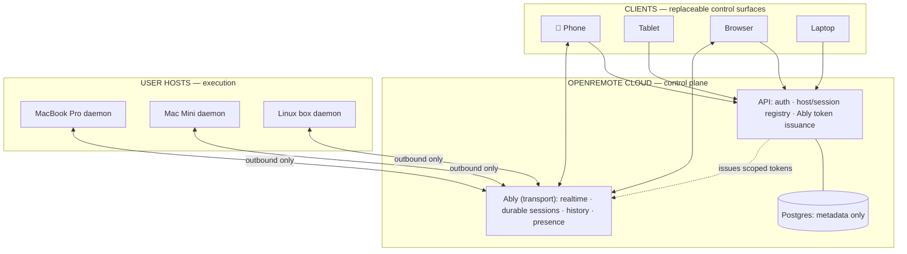
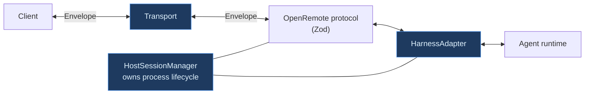
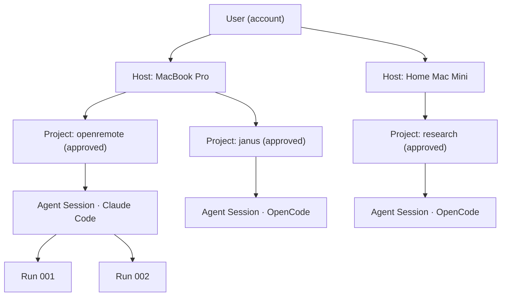
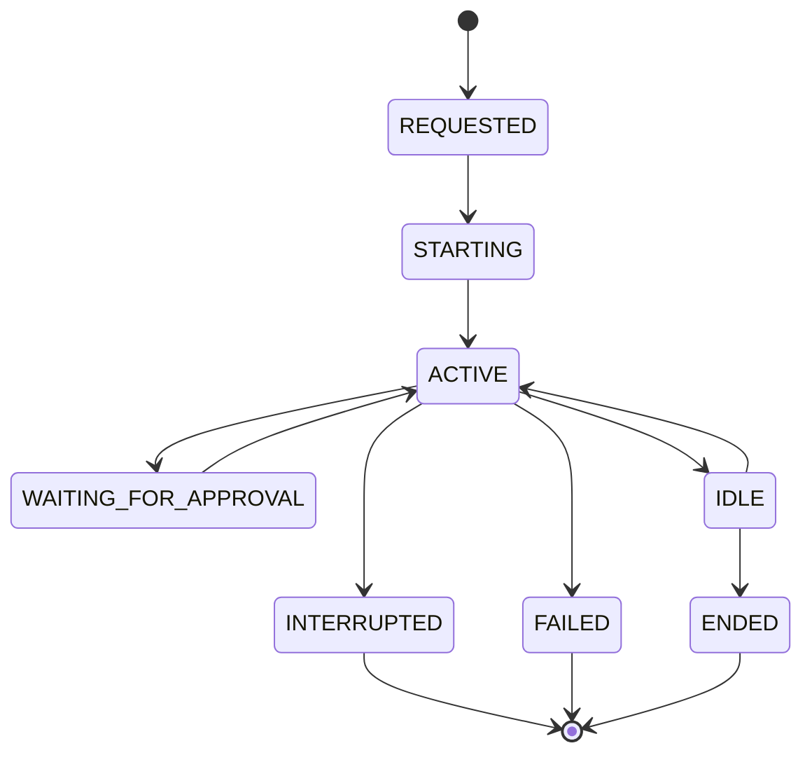
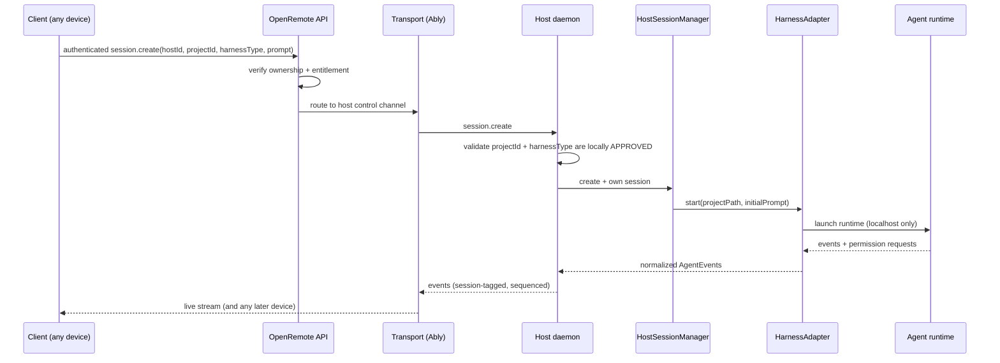
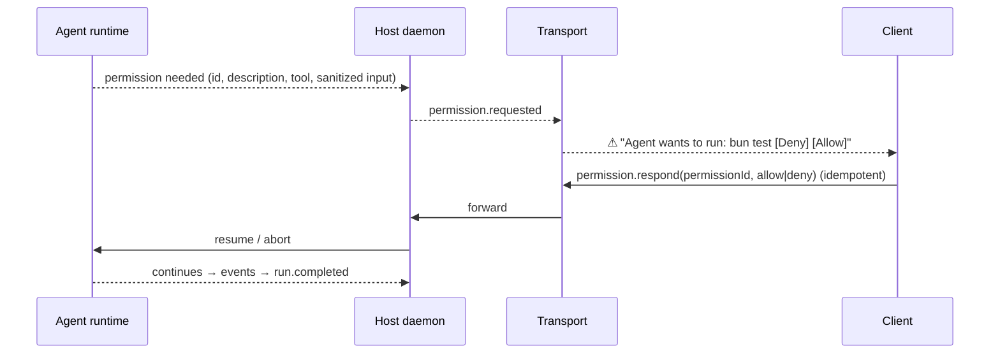
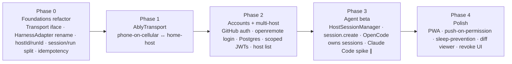

# OpenRemote — Beta / V1 Architecture (design of record)

This is the **target** architecture we are building toward. It is the design of
record derived from the *Design Notes* and the *Beta TDD (v0.2)*, mapped onto the
code that exists in this repo today.

- For **what runs today**, see [`architecture.md`](architecture.md) — the V0
  as-built record. Do not confuse the two: this document describes intent, not
  shipped code.
- The V0 → Beta move is an **evolution along seams we already drew**, not a
  rewrite. §3 and §14 explain exactly which existing pieces change and how.

> **Product statement we are building toward**
>
> Run agents on your machines. Access them from anywhere.
>
> ```
> HOST + WORKSPACE + AGENT         = SESSION
> SESSION + AUTHENTICATED CLIENT   = REMOTE CONTROL
> ```

---

## 1. The reframe: from "phone remote" to "remote runtime + control plane"

V0 was implicitly *a phone remote for one OpenCode instance*. The beta reframes
this to **a remote runtime and control plane for agent sessions that execute on
machines the user owns**. Two decisions carry the whole design:

1. **A session is `HOST + WORKSPACE + AGENT`.** You choose *where* work runs,
   *which* local workspace, and *which* agent — and get a session.
2. **The session belongs to the host, not the client.** This is load-bearing.
   Once sessions are host-owned and daemon-supervised, device-switching,
   reconnect-resume, "close the phone and it keeps working," and multi-device
   control all fall out for free instead of being bolted on.

Clients (phone, tablet, browser, another laptop) are **interchangeable control
surfaces**. Hosts are **execution targets**. Sessions **persist independently of
any client**.



---

## 2. Non-goals for beta (scope discipline)

The plan is unusually disciplined about what beta is **not** — and the lines are
drawn in the right places. Deferred, on purpose:

- **Automatic workspace provisioning** (choose a GitHub repo → clone → checkout →
  install deps → run on an arbitrary host). Beta's "any host" means *any host
  that already has the repo locally and approved*. This keeps the system simple
  and safe.
- **A new coding agent / model runtime / harness** — we integrate, never build.
- **Our own globally distributed realtime infra** — use Ably; revisit only if
  cost/control/enterprise needs justify it.
- **Native iOS/Android apps** — mobile-first web/PWA first.
- **Reliable attach-to-existing-terminal** — beta uses *daemon-owned* sessions;
  terminal attachment is a later compatibility feature.
- **Enterprise RBAC/SSO/SCIM/audit exports**, P2P/WebRTC, Wake-on-LAN,
  cross-host workload routing, multi-agent orchestration.

The through-line: *defer everything not required to put this in ~10 developers'
hands — but don't architect yourself into a corner on what you deferred.*

---

## 3. Abstraction boundaries: one seam becomes three

V0 ships **one** clean seam (`AgentAdapter`). Beta adds **two more**, one on each
side, plus a lifecycle owner. This is the most important section.



**The rule that ties them together:** OpenRemote owns the protocol, the session
lifecycle, and harness selection. A transport only carries messages; a harness
only runs the agent. **No transport-specific or harness-specific object ever
crosses the wire protocol.**

| Seam | Status | Responsibility | Implementations |
|---|---|---|---|
| **`Transport`** | Beta (new) | Move Envelopes. Connect/publish/subscribe/disconnect. | `LocalWebSocketTransport` (V0 relay socket, extracted) · `AblyTransport` (prod) · `OpenRemoteTransport` (future) |
| **`HarnessAdapter`** | V0 `AgentAdapter`, renamed | Drive one runtime; normalize its events to the protocol. | `OpenCodeAdapter` (works today) · `ClaudeCodeAdapter` (spike first) · `CodexAdapter` (later) · `MockAgentAdapter` (tests) |
| **`HostSessionManager`** | Beta (new) | Start/track/resume/terminate daemon-owned sessions; map `projectId`→local path; idempotent command handling. | one per host daemon |

```ts
interface Transport {
  connect(): Promise<void>
  publish(message: Envelope): Promise<void>
  subscribe(handler: (message: Envelope) => void): Promise<void>
  disconnect(): Promise<void>
}

interface HarnessAdapter {
  id: string
  displayName: string
  isInstalled(): Promise<boolean>
  start(input: { projectPath: string; initialPrompt?: string }): Promise<HarnessSession>
  resume?(externalSessionId: string): Promise<HarnessSession>   // best-effort, per harness
  sendPrompt(sessionId: string, text: string): Promise<void>
  interrupt(sessionId: string): Promise<void>
  respondToPermission(sessionId: string, permissionId: string, response: "allow" | "deny"): Promise<void>
  events(sessionId: string): AsyncIterable<AgentEvent>
  stop(sessionId: string): Promise<void>
}
```

---

## 4. Domain model



**Terminology that matters:**

| Term | Meaning |
|---|---|
| **Host** | A computer running the OpenRemote host daemon. One user → **many** hosts (no protocol-level limit; quotas are an app-layer entitlement). |
| **Project** | A host-local **approved** working directory. Clients reference `projectId`; the daemon maps it to the absolute path. Clients never send paths. |
| **Harness** | The local agent runtime for a session (Claude Code / OpenCode / Codex). UI says "Agent". |
| **Agent session** | Long-lived, daemon-owned, bound to one host + one project + one harness. |
| **Run** | One unit of work inside a session (usually one instruction). Sessions persist; runs come and go. |

> **Delta from V0:** V0 conflates *session* and *run*, and has no `hostId`/`Project`
> concept. Beta makes **session vs run** and **multi-host** first-class (see §5).

---

## 5. Transport & protocol

### 5.1 Envelope — evolves from V0

```ts
type Envelope<T> = {
  protocolVersion: 1
  messageId: string     // globally unique → idempotency + tracing
  userId: string        // NEW vs V0
  hostId: string        // NEW vs V0 — multi-host is first-class
  sessionId?: string
  runId?: string        // NEW vs V0 — session/run split
  sequence?: number     // kept: transport-independence + UI reconstruction
  timestamp: number
  message: T
}
```

The routing header (`protocolVersion`, `hostId`, `sessionId`, `messageId`) stays
**visible** so a transport can route; the `message` body is designed so an
**encrypted payload** (§13.3) can be introduced later without changing routing.

### 5.2 Commands (the entire remote-control surface)

`prompt.send` · `session.create(projectId, harnessType, initialPrompt)` ·
`run.cancel` · `permission.respond` · `session.refresh` · `diff.request`.

### 5.3 Events

`host.status` · `session.started` · `run.started` · `assistant.delta` ·
`assistant.message` · `tool.started`/`tool.completed` · `file.changed` ·
`permission.requested` · `run.completed`/`run.failed` · `session.snapshot`.

### 5.4 Channels (Ably) — host control vs session activity

```
openremote:user:{userId}:host:{hostId}:control    # presence, capabilities, session list, session.create
openremote:user:{userId}:host:{hostId}:session:{sessionId}  # prompts, runs, tools, permissions, diffs
```

### 5.5 Ordering & idempotency

- Every command has a unique `messageId`; the host keeps a **processed-message
  cache** so a redelivered command never repeats a destructive action.
- **Permission responses are idempotent** — once terminal, repeated responses
  return the existing result.
- Keep `sequence` in the OpenRemote event model even if Ably serials suffice —
  it keeps the transport replaceable.

---

## 6. Session & run lifecycle



The session is daemon-owned; **phone disconnects do not end it**. A second device
can join without restarting the harness (§9 late-join).

---

## 7. Create-a-session flow



The daemon validates locally: a client asks to "start agent X in **approved**
project Y", never "run command Z" or "use path /any/path".

---

## 8. Permission flow (the headline feature)



The permission object carries a stable `permissionId`, human-readable
description, tool/action class, and **sanitized** structured input. The phone
never sends arbitrary shell text as an approval.

---

## 9. Failure, recovery & late-join

| Failure | Expected behavior |
|---|---|
| Phone loses network | Agent continues; client reconnects and restores history → live. |
| Host loses network | Host shows offline/degraded; daemon retries (backoff). Remote commands rejected/queued with explicit semantics — **never duplicated** on reconnect. |
| Host sleeps | Transport drops; UI shows offline; on wake the daemon re-auths + reconnects. |
| Token expires | Daemon/SDK refreshes via the API without losing product state. |
| Daemon crashes | Service manager restarts it; `HostSessionManager` reloads the local registry and uses **per-harness resume where supported**, else marks `INTERRUPTED` (never blind-restart). |
| Harness exits | Session → `INTERRUPTED`/`FAILED`/`ENDED` by adapter-reported reason; other sessions continue. |
| Duplicate command | Idempotency cache returns the prior outcome. |

**Late join / device switch:** a client loads `session.snapshot` + history, then
transitions gaplessly to live. The daemon is authoritative for local runtime
state; the cloud session is authoritative for delivery/history.

---

## 10. Authentication & pairing

1. **User auth:** normal app auth for the web product; **GitHub** is the natural
   beta default (replaceable provider).
2. **Host authorization:** `openremote login` runs a **device authorization
   flow** → API creates a `HostRecord` and returns a renewable host credential →
   daemon exchanges it for **short-lived, scoped** Ably tokens → user can
   **revoke** a host from the web UI.
3. **Ably credential policy (must-have):** never embed an Ably API key in a
   browser or the host binary. The API signs short-lived JWTs scoping channel
   capabilities to the minimum the user/host needs.

---

## 11. Persistence & data minimization

- **Postgres (metadata only):** `users`, `hosts`, `host_projects` (label +
  status; **absolute path stays host-local**), `agent_sessions`, `session_runs`,
  `host_credentials`, `entitlements`, `audit_events`.
- **Ably (live/session layer):** live stream, prompts/run events within
  retention, presence, permission flow, transient run state.
- **Never mirrored to cloud:** repositories, local paths, credentials, env vars,
  raw terminal output. The host maps `projectId` → path locally.

---

## 12. Host lifecycle & sleep

The daemon runs as a **user-level background service** (macOS `launchd`, Linux
`systemd --user`; Windows later) — *no "keep a terminal open"*. It is the parent
supervisor for daemon-owned sessions, so the phone/web can disappear freely.

**Sleep is the biggest UX trap.** Beta offers an opt-in *"Keep this host awake
while an agent run is active"* (a platform power assertion held only while work
runs). This cannot override hard OS limits (lid-closed on battery may still
sleep) — so the UI must message *"your host is asleep"* clearly. See §15 risk R4.

---

## 13. Security model

### 13.1 Primary threats → controls

| Threat | Control |
|---|---|
| Stolen client token | Short TTL, scoped capabilities, revocation. |
| Cross-user channel access | Server-side ownership checks + per-user/per-host channel scoping. |
| Relay/transport visibility | Move toward app-level E2E (§13.3); never transmit secrets. |
| Command replay | Unique `messageId` + host idempotency cache. |
| Remote arbitrary shell | **No** `shell.exec` in the public protocol (§13.2). |
| Destructive agent action | Structured permission request + explicit human decision. |
| Lost/stolen host | Revocation; rotate credentials; future device keypair. |

### 13.2 Command allowlist as a security *type*, not a guideline

```
ALLOWED:   session.create(projectId, harnessType, initialPrompt)
           prompt.send · run.cancel · permission.respond · diff.request

NOT IN THE PUBLIC PROTOCOL (by design):
           shell.exec("…")   process.spawn("…")
           filesystem.read("/arbitrary/path")
           session.create(projectPath="/any/path")   ← paths are never client-supplied
```

Remote clients speak in `projectId` + `harnessType`, never filesystem paths or
shell strings. This closes the hole where "just start an agent" quietly becomes
arbitrary code execution.

### 13.3 E2E encryption path (fast-follow, not a beta blocker)

Acceptable to ship the first small beta on **TLS + strict authorization + data
minimization**, *provided* the envelope is pre-designed so encrypted payloads
drop in without changing routing:

```
routing header (visible):  protocolVersion, hostId, sessionId, messageId
payload (future E2E):       encrypted command/event body
```

---

## 14. Mapping to the current codebase (V0 → Beta delta)

| We have (V0) | Beta wants | Work |
|---|---|---|
| `AgentAdapter` + `OpenCodeAdapter` + `MockAgentAdapter` | `HarnessAdapter` (+ `ClaudeCodeAdapter`, `CodexAdapter`) | Rename/broaden interface; add `isInstalled`/`resume`/per-session `events` |
| `Bun.serve` WS relay | `Transport` iface + `LocalWebSocketTransport` + `AblyTransport` | Extract interface around existing WS; add Ably behind it |
| Host spawns/owns one OpenCode | `HostSessionManager` owning N sessions × N harnesses | Generalize lifecycle ownership |
| Shared bearer token pairing | GitHub login + `openremote login` device-auth + scoped Ably JWTs | Add API + Postgres + auth |
| Envelope `{deviceId, sessionId, sequence}` | `{userId, hostId, sessionId, runId, sequence}` | Add `hostId`/`runId`; keep `sequence` |
| Per-session sequence in SQLite | Ably serials + `sequence` + idempotency cache | Add processed-message cache |
| "phone remote" framing | Generic clients + multi-host | Framing + data-model change |

**Kept as-is:** the Zod-at-every-boundary discipline, the normalized event
vocabulary, per-session sequencing, and the "no harness object on the wire" rule.

---

## 15. Risks & the amendments we build with

These are the honest execution risks — mostly **not** architectural:

- **R1 — Claude Code harness is the biggest unknown.** OpenCode has a clean SDK +
  localhost server (proven). Claude Code's start/stream/interrupt/permission/**resume**
  via a stable local mechanism is *not* established. **Amendment:** keep
  **OpenCode** as the proving harness through the refactor; run
  `ClaudeCodeAdapter` as a **time-boxed de-risking spike**, not the critical path.
- **R2 — Cross-harness crash/resume is genuinely hard** and differs per runtime.
  The TDD is internally in tension (§13 "mark INTERRUPTED cleanly" vs §17
  acceptance asserting resume). **Amendment:** treat robust resume as
  **best-effort per adapter**, with clean `INTERRUPTED` as the honest default —
  not a beta gate.
- **R3 — Ably lock-in is deeper than "swap a byte pipe."** The `Transport`
  interface protects message-passing, but we lean on Ably *features* (durable
  sessions, history, presence). Leaving Ably later means **re-implementing a
  session/history/presence layer**, not just moving bytes. Build the seam honest;
  don't pretend the feature-set is free to replace.
- **R4 — Sleeping hosts** will generate most "why is it offline?" confusion. One
  checkbox + power assertion is necessary but insufficient; invest in crisp
  in-product "host is asleep" messaging.
- **R5 — Three overlapping recovery mechanisms** (`session.refresh`,
  `session.snapshot`, history hydration). Collapse to one clear recovery path.

---

## 16. Phased plan



Each phase ends at something demoable, and the V0 demo stays green through Phase 0.

**Immediate next three (from the TDD, adjusted per R1):**

1. Extract `Transport`; keep `LocalWebSocketTransport`; add `AblyTransport`;
   prove phone-on-cellular ↔ home-host.
2. Build `HostSessionManager` + `HarnessAdapter`; make `session.create` start &
   **own** a session — proven with **OpenCode**, with the **Claude Code adapter
   as a parallel spike**.
3. Build the phone **New Session** flow (host → approved project → agent →
   prompt → Start) + auth/host registration; verify strict two-host routing.

---

## 17. Beta "done" definition

> A developer can install and sign in once, leave the network, open a phone,
> choose a host + approved project + agent, start a **daemon-owned** session
> remotely, steer it, approve work, and recover from reconnects — **without
> understanding networking or keeping a terminal open.** Give it to ~10 developers.

---

## 18. Verified external assumptions (as of the TDD, 2026-09-01)

- **Ably AI Transport** — durable sessions outlive connections; reconnect/resume;
  multi-device share; human-in-the-loop approvals can wait in-session; ordered
  channel logs + history hydration.
- **Ably auth** — browser/mobile clients get short-lived server-signed tokens/JWTs
  (never embedded keys); capabilities scope publish/subscribe/history/presence.
- **OpenCode** — type-safe TS SDK controlling a local server defaulting to
  `127.0.0.1` — a clean `HarnessAdapter` target we can start/own without exposing
  it publicly. (Already proven in V0.)

---

## 19. Open questions

- Claude Code: which local API/SDK/CLI gives the most stable
  start/stream/interrupt/permission/**resume** while preserving the user's
  existing Claude Code auth? *(R1 spike answers this.)*
- Persist full agent conversation content in Ably history, or minimize to
  structured control/session events? What retention window; what must outlive it?
- How are approved projects registered — `openremote project add .`, first-run,
  or a local picker? (Clients reference `projectId`, never paths.)
- Which actions need **OpenRemote-level** approval on top of each harness's own
  permission system?
- Exact per-harness resume contract after daemon crash / harness exit / reboot.
- What host limit (if any) should the beta UI show, given the architecture
  imposes none?
```
